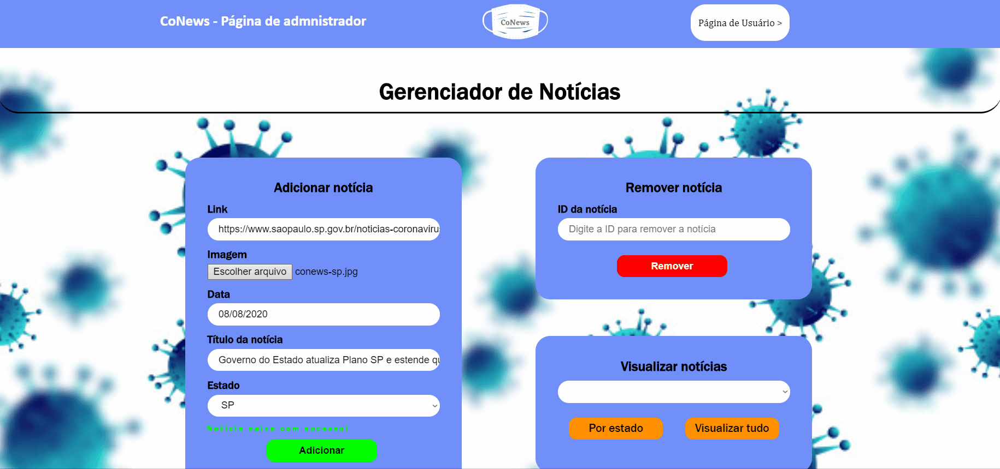

# CoNews

<h3>📺 Apresentation </h3>
<h4>To see a better execution of the application follow this link: <a href="https://youtu.be/LZd6BWTIXDI">CoNews - Functionalities</a> </h4>

<h3>🔧 Functionalities </h3>
<ul>
  <li>
    <h4>🔐 Admin </h4>
    

      <h5>Add a news:</h5>
      
    

    

      <h5>View all news:</h5>
      
    

    

      <h5>Remove news:</h5>
      
    

  </li>
  <li>
    <h4>👥 User </h4>
    

      
    

  </li>
</ul>

<h3>🚀  Technologies</h3>
<ul style="list-style-type:none;">
  <li>
        ✔️ <a  href="https://nodejs.org/en/" target="blank">Node.js</a>
    </li>
    <li>
        ✔️ <a  href="https://expressjs.com/pt-br/" target="blank">Express</a>
    </li>
    <li>
        ✔️ <a  href="https://www.mongodb.com/" target="blank">MongoDB</a>
    </li>
    <li>
        ✔️ <a  href="https://developer.mozilla.org/pt-BR/docs/Web/HTML" target="blank">HTML 5</a>
    </li>
    <li>
        ✔️ <a  href="https://developer.mozilla.org/pt-BR/docs/Web/CSS" target="blank">CSS 3</a>
    </li>
    <li>
        ✔️ <a  href="https://developer.mozilla.org/pt-BR/docs/Aprender/JavaScript" target="blank">JavaScript(ES6)</a>
    </li>
</ul>
<h3>🔥 Install and initialization</h3>
<ul>

To compile and execute the code you msut have Node.js  with npm installed in your computer

	<li><b>1º)</b> Link to install Node.js : https://nodejs.org/en/download/</li>
	<li><b>2º)</b> Download and execute the installation to your Operational System</li>
  <li><b>3º)</b> Now yoy must add a MongoDB Connection String in the app.js file, in the line 32 of the file, to connect to a DB that you have access.</li>
	<li><b>4º)</b> Did that, now open your command line terminal and go to the project folder “CoNews”, if you are using a Windows distribution use the Windows Power Shell as command line terminal.</li>
	<li><b>5º)</b> With the command line terminal opened, now types this command line: "npm install" and wait the dependencies to be installed</li>
	<li><b>6º)</b> After that types "npm start" to run the API.</li>
	<li><b>7º)</b> Open in your browser the index.html file that is in the "/client/user" and "client/admin" folders to use the application.</li>
</ul>

